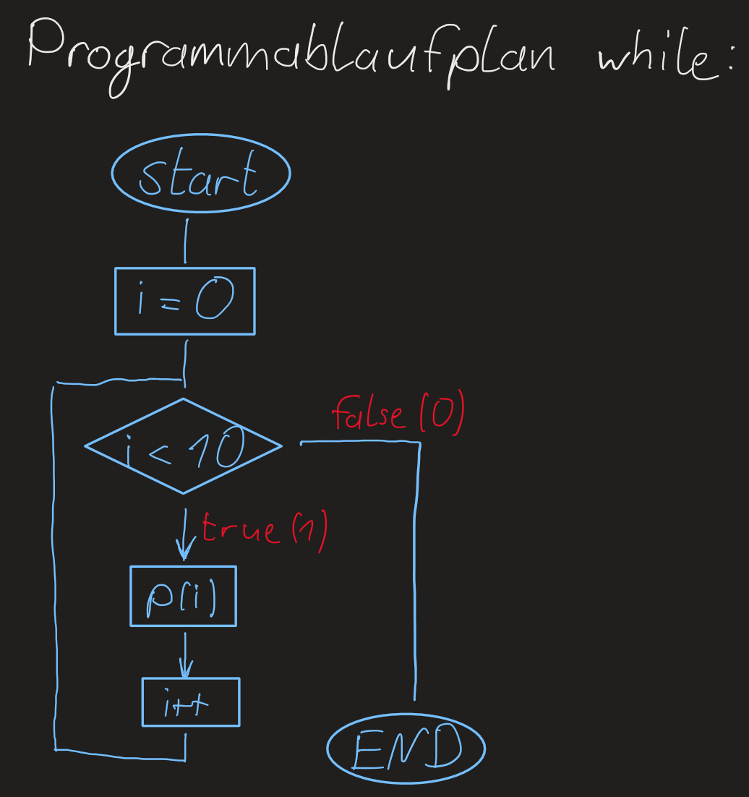
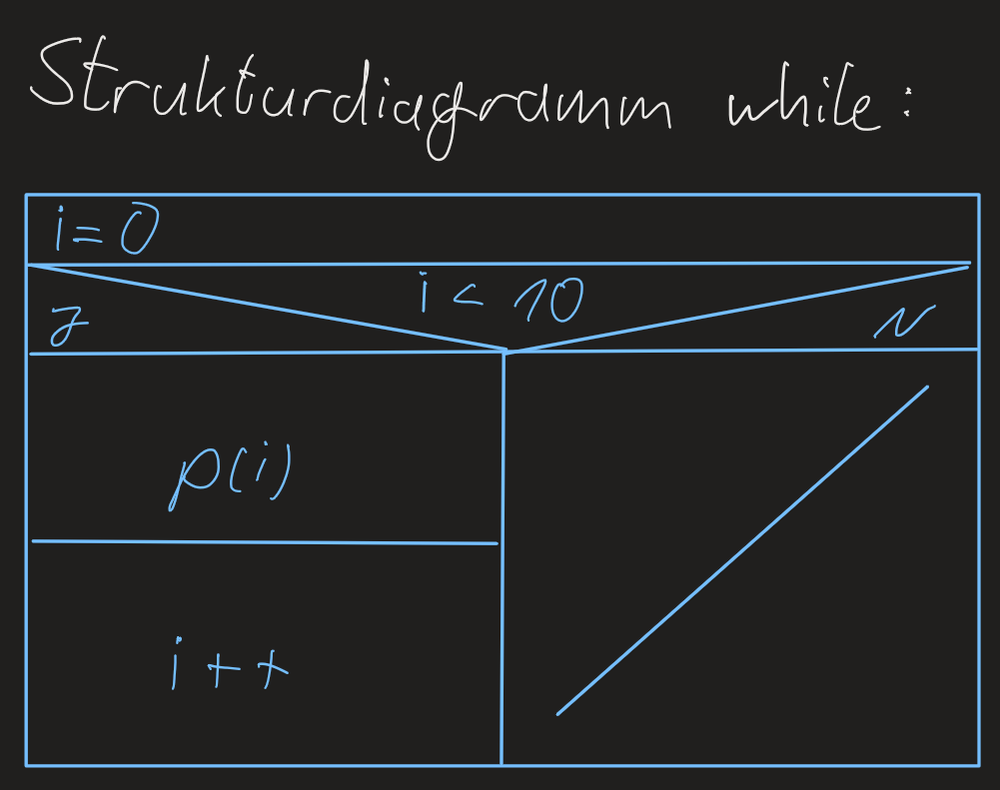
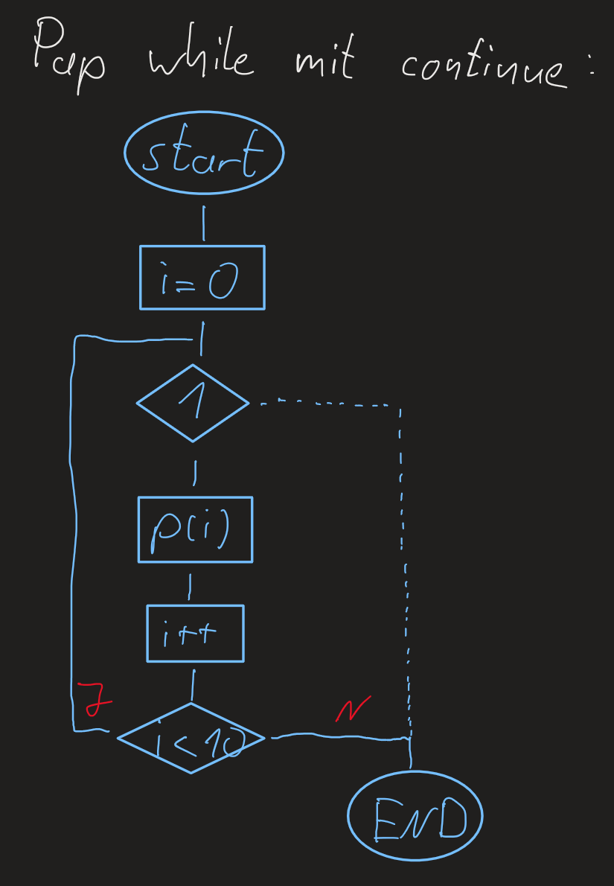
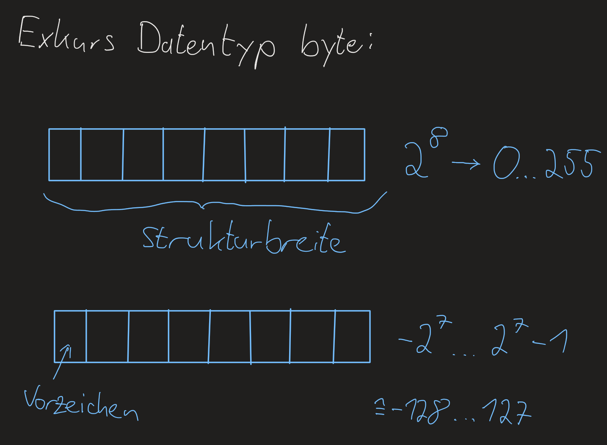
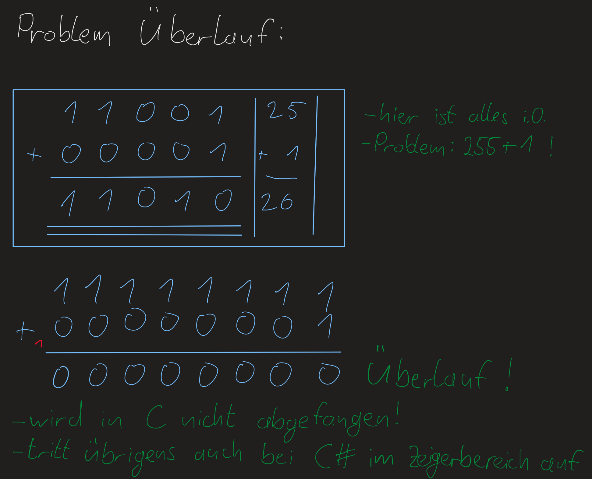
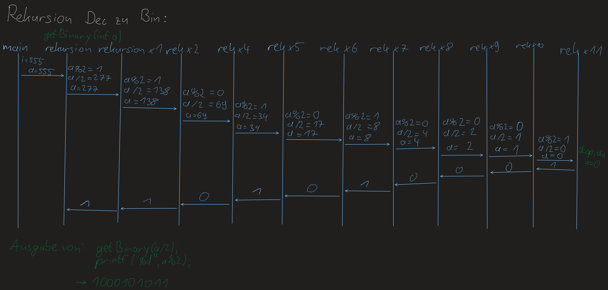

Vorlesung1 Montag 4. Oktober 2021
=================================

Intro:
------

Klausur:

2 Teile, ein praktischer und ein theoretischer.

Man kann sich einen Teil raussuchen.

Jeder kann mit einer 1 aus der Klausur gehen.

Mit Zettel und Stift!

Vorlesung:

Gruppenarbeit in jeder Vorlesung.

Wichtige Kommandos im Terminal:
-------------------------------

- dir (aktuelles Verzeichnis anzeigen)
- ls -a (alles im Verzeichnis)
- ls -l (mehr Infos)
- ls -la (kurze Schreibweise, Reihenfolge von Parametern kann wichtig sein)
- mkdir (Verzeichnis erstellen)
- cd (Verzeichnis wechseln)
- pwd (zeigt aktuelles Verzeichnis an)
- touch (Datei anlegen)
- > (Datei anlegen: > test.txt)
- . aktuelles Verzeichnis
- \.. vorheriges Verzeichnis (Baumstruktur)
- rm (Verzeichnis löschen, -r (rekursiv))
- Zwei Arten von Links (ln datei.txt hardlink.txt, ln -s datei2.txt softlink.txt, Hardlink wird als normale Datei angezeigt, Softlink wird als Link auf die Datei angezeigt)
- cat (Dateiinhalt anzeigen)

Erläuterung ls -la:
###################
drwxrwxr-x
-rw-rw-r--

1 Zeichen d=link, -=Datei

3 Zeichen read, write, execute für aktuellen Nutzer

3 Zeichen für die Gruppe

3 Zeichen für alle anderen

Erläuterung ln:
###############

Hardlink ertellt einen Verweis auf den Inhalt der Originaldatei (Änderungen in beiden ist in jeweils andern vorhanden, ändern ihre Größe, funktionieren nur in der gleichen Partition, bei Löschen )

Softlink erstellt einen Verweis auf die eigentliche Datei (funktionieren immer, auch Partitionsübergreifen, bei Löschen des Softlinks geht auch die Originaldatei kaputt)

VIM Editor:
###########

- vim datei.txt (Erstellt neue Datei und öffnet sie in vim)

Kommandomodus:

- mit ESC in den Kommandomodus wechseln
- :w zum Speichern
- yy Zeile kopieren
- p Zeile unterhalb des Cursors einfügen
- y3y 3 Zeilen kopieren
- P fügt oben ein
- /TextZumSuchen Text suchen
- o neue Zeile unten und Cursor setzen
- O neue Zeile oben
- u Rückgängig
- a einzeichen weiter und Editiermodus
- A Ende und Editiermodus
- mit i in den Einfügemodus wechseln
- mit I Zeilenanfang und Editiermodus
- :s/Zeile/Linie/g Ersetzen von Zeichen, wobei g ein regulärer Ausdruck ist

Grundlagen C:
-------------

- In der Vorlesung verwenden wir ANSI C
- Stammt aus den 70ern
- Siehe auch Kommentare im Programmcode
- // Kommentar IST IN ANSI C NICHT GÜLTIG, nur /\*\*/ sind zugelassen
- Es gibt Funktionen ohne Rückgabewert aber sind nicht konform

- cc -ansi -o 01_erstesc.bin 01erstexc.c zum kompilieren
- mit ./01_erstesc.bin Programm ausführen

- Bsp. eines Hello World Programmes:

.. code-block:: C

	/*Unser erstes C Programm und dies ist der erste Kommentar*/
	#include<stdio.h> /*Header C-LIB*/

	int main(void) /*Funktion, Einstiegspunkt, leerer Parameter*/
	{ /*Codestyle*/
		printf("Hallo ihr lieben Studenten\n");
		return 0; /*Verlässt die Funktion*/
	}
	/*Programm beendet*/

- Es gibt eigentlich nur while-Schleifen, For-Schleife wird vom Compiler zu while-Schleife mit goto gemacht (siehe dazu 03schleifen.c und 04dowhile.c)
- Bsp. Schleife:

.. code-block:: C

	#include<stdio.h>

	int main(void)
	{
		/*Am besten hier oben Variablen deklarieren.
		Der Compiler schiebt die sowieso hoch, 
		weil bei Eintritt in die Funktion, 
		die Speicherbereiche klar sein müssen.
		*/
		int i;

		/*Geht nicht in ANSI C
		for(int i=0; i<10, i++)
		{...}
		*/

		for(i=0; i<10, i++)
		{
			/*%d ist Platzhalter für eine dezimale Zahl*/
			printf("i ist %d und i*i ist %d\n",i,(i*i));
		}

		return 0;
	}

- Beispiele für Schleifen in C
- While-Schleife:

- While-Schleife als Enlosschleife mit Abbruchbedingung:

.. image:: _static/images/4Oktober/papWhileEndlosschleifeC.png
	:width: 400
	:alt: Programmablaufplan While-Schleife Endlosschleife in C

- While Schleife mit `continue`:

- in C wird der Überlauf nicht abgefangen:

- Codebeispiel für den Überlauf:

.. code-block:: C
	
	#inlude<stdio.h>

	int main(void)
	{
		/*unsigned als Schlüsselwort für Datentypen ohne Vorzeichen*/
		unsigned short s1 = 65535;
		unsigned short s2;

		s2 = s1 + 1;

		printf("s1 ist %d\n",s1);
		printf("s2 ist %d\n",s2);

		return 0;
	}

- Reihenfolgen der includes sind bei einigen Bibliotheken nicht egal

- gdb für das Debugging

- Rekursion ist in C implementiert
- Bsp. Umwandeln einer Dezimalzahl in eine Binärzahl mittels Rekursion:

.. code-block:: C

	/*555 -> 1000101011*/
	#include<stdio.h>

	void getBinary(int a)
	{
		if(a>0)
		{
			getBinary(a/2);
			printf("%d",a%2);
		}
	}

	int main(void)
	{
		int i = 255;
		getBinary(i);
		printf("\n");
		return 0;
	}

- Dazu ein Diagramm mit den Funktionsaufrufen:

- Zeichenketten mit #include<string.h>
- Strings werden als char Array (bzw. Vector) deklariert
- Bei Iteration eines 10 Zeichen langen char Arrays mit einem Index >=10, wird auf den Speicher nach dem Array zugegriffen! (siehe 11_vectors.c)
- Im gdb x\32c s1 Speicher auslesen, man erhält ASCII Zeichen
- ASCII Tabelle mit "man ascii" anzeigen lassen
- \\000 (null character) am Ende eines string
- Man kann also nach diesem Zeichen prüfen, um mit strings zu arbeiten (printf Funktion macht das, um die Ausgabe auf der Konsole abzubrechen)

GDB Debugger
------------

Wichtige Befehle
################

+---------------+-------------------------------------------------------+
| run		| Starten						|
+---------------+-------------------------------------------------------+
| list		| Code anzeigen						|
+---------------+-------------------------------------------------------+
| list 15	| Code an Zeile 15 anzeigen				|
+---------------+-------------------------------------------------------+
| break 3	| Breakpoint an Zeile 3 setzen				|
+---------------+-------------------------------------------------------+
| backtrace	| Fuktionsaufruf Hierarchie anzeigen			|
+---------------+-------------------------------------------------------+
| print n	| Inhalt der Variablen n ausgeben			|
+---------------+-------------------------------------------------------+
| info locals	| Inhalt aller lokaler Variablen ausgeben		|
+---------------+-------------------------------------------------------+
| next		| Nächsten Befehl ausführen				|
+---------------+-------------------------------------------------------+
| continue	| Programmablauf um nächsten Breakpoint fortsetzen	|
+---------------+-------------------------------------------------------+
| clear		| Breakpoint löschen					|
+---------------+-------------------------------------------------------+
| step		| Gehe in die nächste Funktion (z.B. auch printf())	|
+---------------+-------------------------------------------------------+
| quit		| Dubugging beenden					|
+---------------+-------------------------------------------------------+
| x\\32c s1	| Speicher von Variabler (Vector) s1 auslesen		|
+---------------+-------------------------------------------------------+

