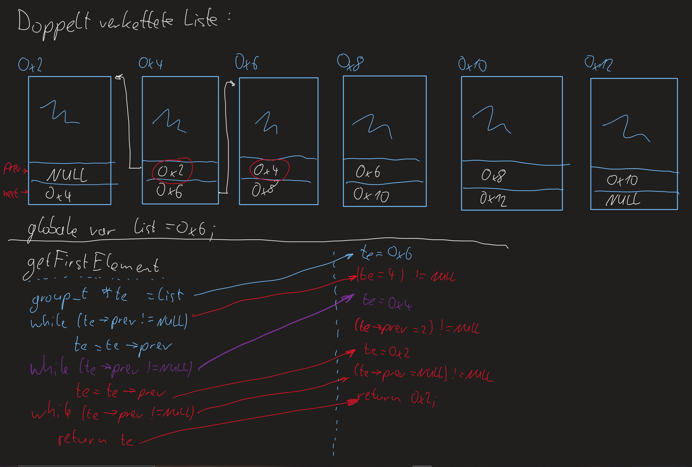

Vorlesung3 Montag 8.November 2021
=================================

Allokieren von Speicher
-----------------------

- Was passiert, wenn man bereits allokierten Speicher vergrößert?
- Siehe Wiederholung.c .
- Wenn man sich den Speicher mit (gdb) x/48 s1 anschaut, sieht man wie die beieden Strings zueinander liegen. Es werden '!' als Marker gesetzt, um zu zeigen wie der Speicher mal reserviert wurde. '1 \r \002' zeigt das Ende des allokierten Speichers.
- Wenn mit s1 = realloc(s1,30); Speicher neu allokiert wird, dann ändert sich nichts, wenn der neu allokierte Speicher noch passt. Sonst wird er an eine neue Stelle geschrieben.
- Was beim reallokieren passier, ist im folgenden Bild zu sehen

.. image:: _static/images/8November/wiederholung.png
	:width: 800
	:alt:

- Wiederholung von struct
- siehe structWiederholung.c

.. image:: _static/images/8November/structEinstieg.png
	:width: 800
	:alt:

.. image:: _static/images/8November/structBesserDynamisch.png
	:width: 800
	:alt:

.. image:: _static/images/8November/verketteteListen.png
	:width: 800
	:alt:

.. image:: _static/images/8November/einfachVerketteteListe.png
	:width: 800
	:alt:

.. image:: _static/images/8November/sortierenDerListe.png
	:width: 800
	:alt:

- Das Gleiche für eine doppelt verkettete Liste
- Code siehe 02_doppeltVerketteteListe.c

.. image:: _static/images/8November/clearElements.png
	:width: 800
	:alt:

- Aufgabe (siehe 02_doppeltVerketteteListe.c sortElements() und swapElementsWithNext())

